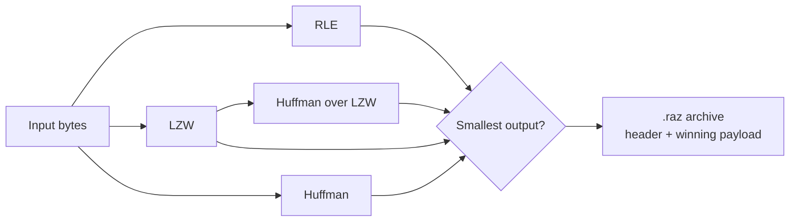

# RAZ Archiver — Multi-Algorithm File Compressor


**RAZ Archiver** is a desktop file compression application built in Java with a JavaFX user interface. Instead of relying on a single algorithm, it compresses every input using **four competing strategies** — RLE, LZW, Huffman, and a hybrid LZW + Huffman pipeline — then automatically stores whichever produced the **smallest result**.

Files are packed into a custom `.raz` archive format (with CRC32 integrity verification), and entire folders are compressed into a portable `.raz.zip` container. Decompression is fully lossless: the winning algorithm, original file extension, and a checksum are all embedded in the archive header, so any archive can always be restored to a byte-identical copy of the original.

---

## Features

- **Adaptive multi-algorithm compression** — RLE, LZW, Huffman, and LZW + Huffman are all executed; the best result wins automatically.
- **Custom `.raz` archive format** — self-describing header with a magic number, algorithm name, original extension, original size, and CRC32 checksum.
- **Lossless, verified restoration** — every decompressed file is validated against its CRC32 checksum before being written.
- **File and folder support** — compress a single file to `.raz`, or recursively compress a whole folder into a `.raz.zip` container that preserves the directory structure.
- **Modern JavaFX GUI** — drag-and-drop zones, file/folder choosers, background processing (non-blocking UI), and a one-click "Download Result" flow.
- **Compression analytics** — a stats window reports original size, compressed size, the winning algorithm, and the achieved compression percentage.
- **Corruption detection** — invalid magic numbers or checksum mismatches are caught with clear errors (`Invalid .raz file!`, `Checksum mismatch — file corrupted!`).

---

## Compression Algorithms

All algorithms implement a common abstract base class (`CompressionAlgorithm`) exposing `compress(byte[])` and `decompress(byte[])`.

| Algorithm | Technique | Best Suited For |
|---|---|---|
| **RLE** | Replaces runs of repeated bytes with `(count, value)` pairs (max run length 255). | Data with long repeated sequences, e.g. simple graphics, logs. |
| **LZW** | Dictionary coding: builds a dynamic dictionary of byte sequences (seeded with all 256 byte values) and emits fixed 16-bit codes; the dictionary resets at 65,536 entries. | Repetitive text and structured data. |
| **Huffman** | Variable-length prefix coding driven by byte frequency. The code tree is serialized (preorder: `1` = leaf, `0` = internal node) and embedded in the output. | Data with a skewed byte-frequency distribution. |
| **LZW + Huffman** | Hybrid pipeline: LZW output is passed through Huffman coding for compounding gains. | Data that benefits from both dictionary and entropy coding. |

### How the Adaptive Pipeline Works



The compressor runs all four candidates on every input, compares their output sizes, and stores the smallest one. The winner's name is recorded in the file header so decompression knows exactly how to reverse it.

---

## The `.raz` File Format

Every archive is laid out as:

```
+-----------------+---------------------------+---------------------------+
| Header Length   | File Header (variable)    | Compressed Payload        |
| (4 bytes, int)  |                           | (variable)                |
+-----------------+---------------------------+---------------------------+
```

The header itself contains:

| Field | Type | Description |
|---|---|---|
| Magic number | 4 bytes | `'R' 'A' 'Z' '!'` — identifies a valid archive |
| Pipeline name | UTF string | Winning algorithm (`RLE`, `LZW`, `Huffman`, or `LZW+Huffman`) |
| Original extension | UTF string | e.g. `.txt`, `.png` — used to restore the file |
| Original size | 8-byte long | Original file size in bytes |
| CRC32 checksum | 4 bytes | Checksum of the original data, verified on decompression |

**Folder archives:** each file inside the folder is compressed individually as its own `.raz` entry, and all entries are written into a standard ZIP container named `<folder>.raz.zip`, preserving relative paths. On extraction, the original directory tree is rebuilt under `restored_<folder name>/`.

---

## Project Structure

```
2nd-Semester-Project-SP26-JAVA-main/
├── File Compressor/                     # Maven project
│   ├── pom.xml
│   └── src/
│       ├── RAZ Archiver LOGO.jpg        # UI assets
│       ├── raz_icon.png
│       ├── File Icon.png
│       └── main/java/com/compressor/
│           ├── algorithm/
│           │   ├── CompressionAlgorithm.java   # Abstract base class
│           │   ├── RLE_Compressor.java         # Run-Length Encoding
│           │   ├── LZW_Compressor.java         # Lempel-Ziv-Welch
│           │   └── Huffman_Compressor.java     # Huffman coding
│           ├── core/
│           │   ├── MultiLevelCompressor.java   # Adaptive pipeline + archive I/O
│           │   └── FileHeader.java             # .raz header (serialize/deserialize)
│           ├── gui/
│           │   └── MainWindow.java             # JavaFX application entry point
│           └── io/
│               └── FileHandler.java            # File read/write helpers
└── Project Material/
    ├── Complete Guide.pdf
    └── UML Diagram.png
```

---

## Requirements

| Dependency | Version |
|---|---|
| JDK | 25 or later |
| Maven | 3.x (or the bundled Maven in your IDE) |
| JavaFX SDK | 21+ (required on the module path at runtime) |

---

## Getting Started

### Run from IntelliJ IDEA (recommended)

1. Open the `File Compressor` folder in IntelliJ IDEA.
2. Make sure **Project SDK** is set to JDK 25 (`File → Project Structure → Project`).
3. Ensure the **JavaFX SDK** is available and added to the classpath/module path (IntelliJ's bundled JavaFX setup or a locally installed SDK).
4. Run `MainWindow.main()` (`src/main/java/com/compressor/gui/MainWindow.java`).

> **Note:** the logo and icon assets are loaded from the `src/` directory at runtime, so launch the application with the project root as the working directory (the IntelliJ default).

### Build with Maven

```bash
cd "File Compressor"
mvn clean compile
```

> The bundled `pom.xml` does not declare JavaFX as a Maven dependency — the GUI is currently resolved through the IDE/SDK setup. To build and run purely with Maven, add the JavaFX artifacts:
>
> ```xml
> <dependency>
>     <groupId>org.openjfx</groupId>
>     <artifactId>javafx-controls</artifactId>
>     <version>21</version>
> </dependency>
> ```
>
> together with the `javafx-maven-plugin`:
>
> ```xml
> <plugin>
>     <groupId>org.openjfx</groupId>
>     <artifactId>javafx-maven-plugin</artifactId>
>     <version>0.0.8</version>
>     <configuration>
>         <mainClass>com.compressor.gui.MainWindow</mainClass>
>     </configuration>
> </plugin>
> ```
>
> then launch with `mvn javafx:run`.

---

## Usage

1. **Launch** the application — the *RAZ Archiver* window opens.
2. **Compress:**
   - Drag and drop a file or folder onto the left panel (or use **Select File** / **Select Folder**).
   - Click **COMPRESS** — processing runs in the background.
   - Click **View Compression Stats** to see original size, compressed size, the winning algorithm, and the compression percentage.
   - Click **Download Result** and choose where to save the `.raz` file (or `.raz.zip` for folders).
3. **Decompress:**
   - Drag and drop a `.raz` file or a `.raz.zip` archive onto the right panel.
   - Click **DECOMPRESS** — the original data is restored and integrity-checked.
   - Click **Download Result** to save the restored file (or folder tree) anywhere on disk.

---

## Technical Highlights

- **Polymorphic design** — a single abstract `CompressionAlgorithm` contract makes it trivial to add new algorithms; the pipeline treats them uniformly.
- **Self-describing archives** — decompression requires no user input; everything needed (algorithm, extension, size, checksum) travels inside the header.
- **Data integrity** — CRC32 checksums guard against silent corruption; mismatched data is rejected with an explicit error.
- **Responsive UI** — all compression work executes on a JavaFX `Task` background thread, with results marshalled back to the UI via `Platform.runLater()`, keeping the window responsive on large files.
- **Memory-conscious I/O** — streaming ZIP input/output for folder operations and buffered byte streams throughout.

---

## Documentation

Additional project documentation is available in the [`Project Material`](Project%20Material/) folder:

- **Complete Guide.pdf** — full project walkthrough and report.
- **UML Diagram.png** — class diagram of the application architecture.

---

## Contributors

This project was developed by two contributors:

- **Muhammad Abuzar (Muhammad-Abuzar-code)**
- **Muhammad Rabee Umar (mrabeeumar)**

---

## Course Context

This project was developed as a **2nd Semester Java Programming Project (SP26)**, demonstrating object-oriented design, data structures (priority queues, hash maps, binary trees), file I/O, and desktop GUI development in Java.
